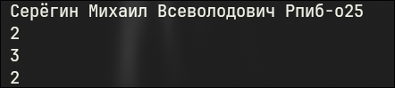

# Лабораторная работа #1
### Код:

### Вывод программы:

### Обьяснение:
Такое уравнение разрешимо только тогда, когда наибольший общий делитель a и n делит правую часть, то есть gcd⁡(a,n)∣1, значит gcd⁡(a,n)=1. Таким образом, обратный элемент существует только для взаимно простых a и n.

Для нахождения коэффициентов b и y используется расширенный алгоритм Евклида, который находит целые числа x и y, удовлетворяющие равенству:
a⋅x+n⋅y=gcd⁡(a,n).

Если gcd⁡(a,n)=1, то x и будет искомым обратным элементом (возможно, отрицательным). Чтобы получить положительное число в диапазоне от 0 до n−1, мы берём остаток от деления x на n и при необходимости корректируем знак.
